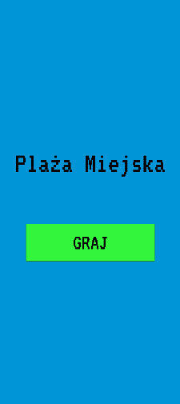
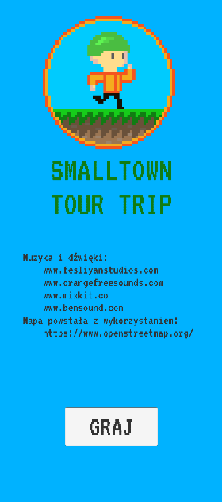
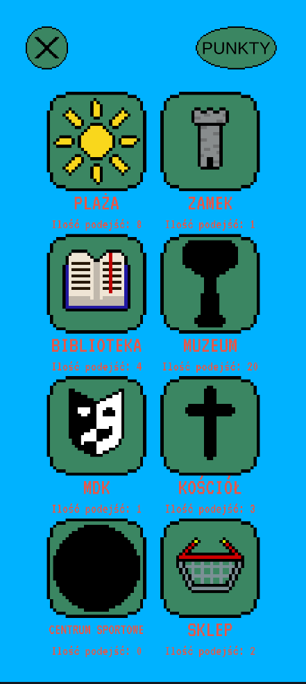

# Implementation of mobile game using GPS
#### Mobile game using location  created in Unity for my Engineer's Thesis

## Table of Contents
* [General Info](#general-information)
* [Technologies Used](#technologies-used)
* [Features](#features)
* [Screenshots](#screenshots)
* [Setup](#setup)
* [Project Status](#project-status)
* [Room for Improvement](#room-for-improvement)

## General Information
- Smalltown Tour Trip is a simple game similar to Pokemon Go working on Android
- You are being guided around city of Szczytno by friendly spirit
- Whenever you get to one of highlighted buildings you can start platforming level
- Application is a subject of my Engineer's Thesis, that I defended on UWM with the highest grate

## Technologies Used
- Unity - version 2019.4.0f1
- Visual Studio 2019

## Feature
- Using GPS of your mobile device
- All graphic stuff was created by myself

## Screenshots

## Setup
- To run app on Android device just download and install [Wersja1.0.apk](./Wersja1.0.apk)
- You need a device with Android 5.0 or higher
- You have to be in area of Szczytno city center, otherwise use some mock location app
- You can also use some Android emulator on your PC, personaly I used [LDPlayer](https://www.ldplayer.net/) to work on this project

## Project Status
Project is:  complete, but there is room for improvement. Actually I don't have time for work on it.

## Room for Improvement

Room for improvement:
- Make iOS version
- Create bigger map that includes other cities
